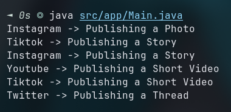
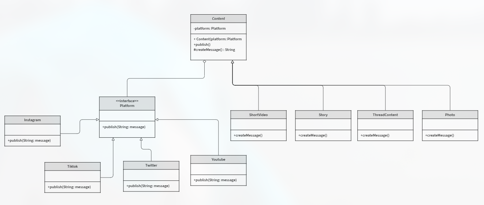

# Bridge Social Media

Este proyecto es un ejemplo práctico de cómo puedes interactuar con diferentes plataformas de redes sociales (como Twitter, TikTok, Instagram o Youtube) sin que tu código se vuelva un problemon cada vez que añades una nueva red o un nuevo tipo de contenido.

## ¿Cuál es el problema que resuelve?

Imagina que quieres publicar una historia, un video corto o una foto. Cada red social tiene sus propias reglas y formas de manejar estos contenidos. Si no tienes una buena estrategia, terminarías con mucho código repetido y complicado: un pedazo de código para subir fotos a Twitter, otro para historias en Instagram, otro para videos en TikTok, ¡y así sucesivamente! Cada vez que agregas una nueva red social o un nuevo tipo de publicación, tendrías que reescribir y adaptar un montón de cosas. ¡Un verdadero dolor de cabeza!

## ¿Cómo ayuda el patrón Bridge aquí?

Aquí es donde entra en juego nuestro amigo el patrón de diseño **Bridge**. En lugar de acoplar directamente el tipo de contenido (fotos, historias, videos cortos e hilos) con la plataforma social, los "separamos".

Piensa en esto como tener dos "lados":

1.  **El lado de los Contenidos**: Aquí tenemos las definiciones generales de lo que es una `Foto`, una `Historia`, un `Video Corto`, un un `hilo`. A ellos no les importa *dónde* se publicarán, solo saben qué tipo de contenido son.
2.  **El lado de las Plataformas**: Aquí tenemos cómo `Twitter`, `TikTok` o `Instagram` *realmente* manejan la publicación. Cada plataforma sabe cómo recibir cualquier tipo de contenido.

El **Bridge** es el "puente" que une estos dos lados de forma flexible. Así, si queremos añadir:

*   **Un nuevo tipo de contenido** (¡digamos, un GIF animado!): Solo lo creamos en el lado de los `Contenidos` y cada plataforma ya sabrá cómo manejarlo a su manera, sin que tengamos que modificar las plataformas existentes.
*   **Una nueva red social** : Solo la añadimos en el lado de las `Plataformas` y automáticamente será compatible con todos los tipos de contenido que ya tenemos, sin necesidad de tocar el código de los contenidos.

Esto hace que el sistema sea mucho más fácil de extender y mantener.

## Captura de Consola

## Diagrama de clases

